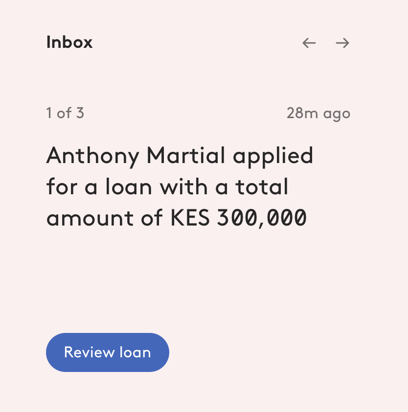
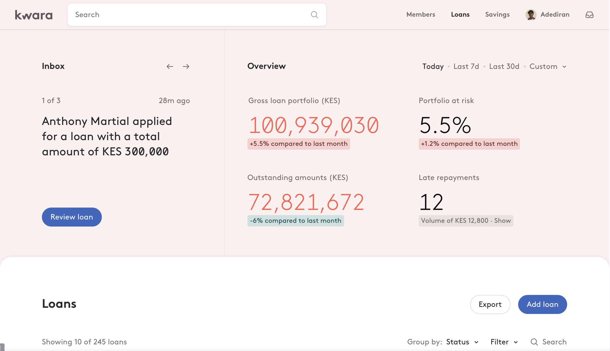

# Inbox

## Installation

After you have cloned:

```sh
cd inbox-slider
yarn && yarn start
```

On a different shell start the server:

```sh
yarn serve
```

## Exercise

Here are 2 visuals for you:

- Inbox: a notification slider. This is the component the exercise revolves around.



- Inbox-page: that shows an example of placement of the Inbox within a page. **This is just for your reference and you are NOT expected to build any of this.**



The current repo is the Slider in its current form, developed previously by a junior dev.
It is functionally working and making calls to an endpoint that returns Loan data `/api/inbox/loans`. 
Clone the repo and follow the instructions to get it up and running.
If everything goes smoothly you will have a local version of the slider visible on http://localhost:3000/

We now have to support a second endpoint that returns data related to the Till, `api/inbox/till`.
This is the primary task for today, making sure that the existing `<Inbox />` Component works for both use cases. The goal is that the one inbox can show the user both types of messages.

You may notice the server is sporadically unstable, returning an error. We ask that you handle the errors in a reasonable way. Unfortunately, the UX designer is out sick, so the implementation is in your hands how best to do that.

You are free to approach the task in any way that makes sense for you.
Feel free to modify and restructure any of the existing files in the `src/` directory to make sure that the component adapts to the new requirements. 
You are encouraged to change the existing implementation (code, structure, etc.) and suggest any improvement to make the feature and the code-base as a whole more solid and future proof.

To be clear, code improvements of any kind are welcome and encouraged, even changes that are not concerning the `<Inbox />` component (exception: please do not change anything in the `server/` directory). Our goal with this challenge is to get a sense of how you work, your code quality and style, and what your strengths are, so go for it, show off!

Some details for you to consider:

- Since the interaction is very simple, please avoid adding any state management library (like Redux, Mobx or similar).
- Clear separation of concerns.
- This is very important, solve it like you'd do considering a bigger picture of an existing codebase that will grow and change in the future in ways that are hard to predict today.
- We appreciate if you could git commit each relevant step of your development.
- We suggest submitting the challenge latest 4 days after receiving it, unless another timeframe has already been discussed.
- Don't try and make it perfect at all cost, though. Some rough edges here and there are totally ok. If you feel something can be improved, add your view about it in the Readme and we can just talk through it on our next call. As long as there's enough for us to review and to see where your strengths are it will be alright.

Please add a quick README alongisde this one, where you clarify your general approach. 
We are really interested in what you think about the current implementation and your suggestions to make it better.
We'd also like to hear your feedback on the challenge itself. Critical feedback is encouraged, so feel free to share any thoughts you might have.

Once finished please:

1. upload master to a private repo under your personal Github profile
2. open a PR against it with your solution
3. **transfer the ownership** of the repo to the account of the person you were in contact with (ask us in case you are unsure about this)

If you have any question just write us an email and we will reply as soon as possible.

Good luck!

## My Solution

I decided to keep it simple and within the same component at the same time separate concerns for future improvements.  just like our gmail accounts I wanted the user to be able to switch between messages using a button almost similar to the way we can switch between primary email and promotion and social emails in our gmail accounts.

I have added a separate component that displays till messages so as to cater for future changes that may be made to the display of till messages. I felt this would be better than adding conditional renders within the message component incase in the future till messages may have to be displayed in a  completely different way .
My solution enables the user to switch between till messages and loan message views within the inbox component. I have also added some media queries to make it more responsive and handled crushes that were happening when the user clicks next or previous button when the  server sporadically fails . 

What to expect 
The image below displays loan messages with a button above to switch to till messages.


The image below displays till messages with a button above to give the user a chance to switch back to loan messages.


